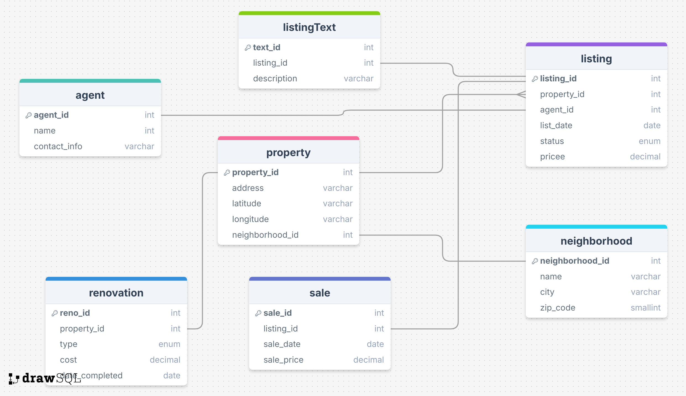
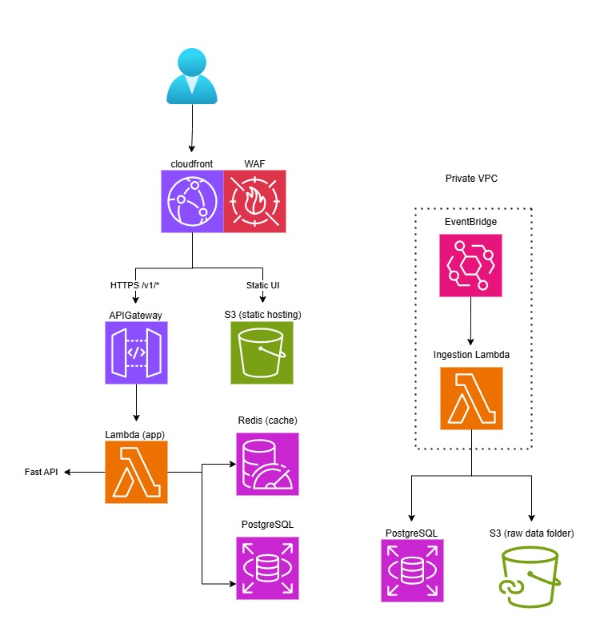

# Real Estate Investment Analysis Platform

A comprehensive platform for analyzing real estate investments, tracking renovations, and managing property portfolios.

## Features

- Property listing and management
- Investment analysis tools
- Renovation tracking
- Sales history
- Market analysis
- Portfolio management

## Tech Stack

- Backend: FastAPI, SQLAlchemy, PostgreSQL
- Frontend: React, TypeScript, Tailwind CSS
- Database: PostgreSQL
- Authentication: JWT

## Prerequisites

- Python 3.8+
- Node.js 16+
- PostgreSQL
- Git

## Setup Instructions

### Backend Setup

1. Navigate to the backend directory:

```bash
cd backend
```

2. Create and activate a virtual environment:

```bash
# Windows
python -m venv venv
.\venv\Scripts\activate

# Linux/Mac
python -m venv venv
source venv/bin/activate
```

3. Install dependencies:

```bash
pip install -r requirements.txt
```

4. Set up the database:

```bash
# Create the database
createdb real_estate_db

# Run migrations
alembic upgrade head

# Seed the database
python scripts/seed_database.py
```

5. Start the backend server:

```bash
# Make sure you're in the backend directory
python -m uvicorn app.main:app --reload
```

The API will be available at `http://127.0.0.1:8000`

### Frontend Setup

1. Navigate to the frontend directory:

```bash
cd frontend
```

2. Install dependencies (choose one):

```bash
# Using npm
npm install

# OR using Yarn
yarn
```

3. Start the development server (choose one):

```bash
# Using npm
npm run dev

# OR using Yarn
yarn dev
```

The frontend will be available at `http://localhost:5173`

## API Documentation

Once the backend server is running, you can access:

- Interactive API documentation: `http://127.0.0.1:8000/docs`
- Alternative API documentation: `http://127.0.0.1:8000/redoc`

## Testing the Integration

1. Start the backend server first (from the `backend` directory)
2. Start the frontend development server (from the `frontend` directory)
3. Open your browser to `http://localhost:5173`
4. The frontend should automatically connect to the backend API

## Common Issues

- If you get "Not Found" errors when accessing the API:

  - Make sure you're running the server from the `backend` directory
  - Verify the server is running on `http://127.0.0.1:8000`
  - Check that the database is properly seeded

- If the frontend can't connect to the backend:
  - Ensure both servers are running
  - Check that the backend is running on the correct port (8000)
  - Verify there are no CORS issues in the browser console

## Contributing

1. Fork the repository
2. Create a feature branch
3. Commit your changes
4. Push to the branch
5. Create a Pull Request

## License

This project is licensed under the MIT License - see the LICENSE file for details.

---

## 🏗️ Project Structure

```
real-state-project/
├── backend/   # FastAPI backend (Python)
├── frontend/  # React + Vite frontend (JS/TS)
├── docker-compose.yml
└── README.md
```

- **Frontend**: React app served by Nginx, built with Vite.
- **Backend**: FastAPI REST API (Python), running on Uvicorn.
- **Database**: PostgreSQL container.

---

## 🚀 Quick Start (Local Development)

1. **Clone this repository**

   ```bash
   git clone https://github.com/youruser/real-state-project.git
   cd real-state-project
   ```

2. **Run everything with Docker Compose**

   ```bash
   docker-compose up --build
   ```

   - **Frontend**: [http://localhost:3012](http://localhost:3012)
   - **Backend API docs**: [http://localhost:8000/docs](http://localhost:8000/docs)
   - **Database**: accessible at `localhost:5432` (user: `user`, pass: `pass`, db: `realestate`)

3. **To stop the services**

   ```
   docker-compose down
   ```

---

## 🧩 Project Components

### Backend (FastAPI)

- Located in `/backend`
- Main entry: `backend/app/main.py`
- Key dependencies: FastAPI, Uvicorn, SQLAlchemy, psycopg2-binary

### Frontend (React + Vite)

- Located in `/frontend`
- Main entry: `frontend/index.html` and `frontend/src/main.jsx`
- Built and served by Nginx for production-like local development

### Database (PostgreSQL)

- Dockerized Postgres 15 container
- Connection settings defined in `docker-compose.yml` and `.env` files

---

## 🐳 Docker Compose Overview

- **frontend**: Builds and serves the React app using Nginx.
- **backend**: Runs the FastAPI app on Uvicorn.
- **db**: Launches a Postgres database instance.

**All containers are networked and managed together for a seamless dev experience.**

---

## ⚙️ Environment Variables

- `backend/.env.development` (example)

  ```
  DATABASE_URL=postgresql://user:pass@db:5432/realestate
  ```

- `frontend/.env.local` (example)

  ```
  VITE_API_URL=http://localhost:8000
  ```

---

## 📖 API Documentation

- FastAPI auto-generates docs at [http://localhost:8000/docs](http://localhost:8000/docs).
- Try the root endpoint:

  ```
  GET /   ->   { "message": "Hello, Real Estate!" }
  ```

---

## 🛠️ Useful Commands

- **Rebuild images after changes:**

  ```bash
  docker-compose build
  ```

- **Run only backend or frontend:**

  ```bash
  docker-compose up backend
  docker-compose up frontend
  ```

---

## 🗂️ Entity Relationship Diagram (ERD)



## 🖼️ Project System Design



---

## 📄 License

[MIT License](LICENSE)

---

## 👤 Author

_Spencer Navas_

---
